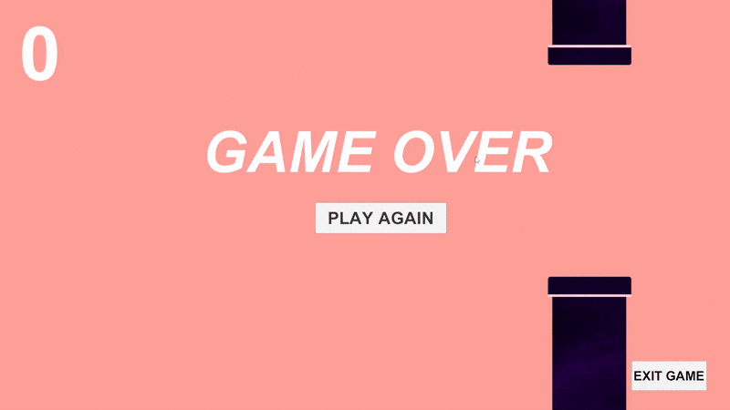

# Flappy Bird Recreation 🎮

A simple **Flappy Bird clone** made in Unity. 🕹️ Fly through obstacles and try to get the highest score!




## Features
- **Physics-based movement** 
- **Randomized Pipe Spawning** 
- **Score Tracking** 
- **Game Over & Restart System** 
- **Exit Game Button** 

## 🎮 How to Play
- **Press SPACEBAR** to flap and keep the bird in the air.
- **Avoid obstacles** and try to pass through the gaps.
- **Survive as long as possible** and achieve a high score!

## Installation
1. **Clone the repository**:
   ```sh
   git clone git@github.com:ryansaharwork/Flappy-Bird-Recreation.git
